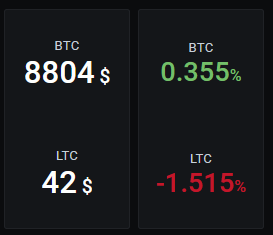

# cryptowat_exporter 

[](https://github.com/nbarrientos/cryptowat_exporter/actions?query=workflow%3ABuild) 
[](https://github.com/nbarrientos/cryptowat_exporter/actions?query=workflow%3ARelease)
[](https://hub.docker.com/r/nbarrientos/cryptowat_exporter)
[](https://github.com/nbarrientos/cryptowat_exporter/releases)


A [Prometheus](https://prometheus.io/) exporter to fetch values from [cryptowat.ch](https://cryptowat.ch) written in Go.

## Installation

Binaries can be downloaded from the Github releases page. A Docker image hosted on Dockerhub is also available.

Building yourself is rather easy, just install `golang` and `make` and run:

```
make
```

To build a Docker image yourself, adjust the Docker architectures in the `Makefile` and run:

```
make docker
```

To use the pre-built image just pull it:

```
docker pull nbarrientos/cryptowat_exporter
```

## Usage

```
./cryptowat_exporter
```

or with Docker (self-built):

```
sudo docker run -d --name cryptowat_exporter -e "TZ=Europe/Zurich" --user yourchoice -p 9745:9745 prom/cryptowat_exporter:master
```

or pre-built:

```
sudo docker run -d --name cryptowat_exporter -e "TZ=Europe/Zurich" --user yourchoice -p 9745:9745 nbarrientos/cryptowat_exporter
```

Then visit `http://localhost:9745/metrics`

Please note that publishing the exposed ports is optional. For instance if you do IPv6 global address allocation at container start time
you might not want to pass `-p` at all.

## Configuration

The exporter takes some command line parameters that allow configuring a few things:

* `--cryptowat.exchanges`: Comma separated list of exchanges to scrape (default: `bitstamp,kraken,coinbase-pro`)
* `--cryptowat.pairs`: Comma separated list of pairs to scrape (default: `btcusd,ltcusd`)
* `--cryptowat.cachesecs`: Number of seconds to cache values for (default: 60)
* `--web.listen-address`: Address and port to listen on (default: `:9745`)

Docker users can customise the list of exchanges, pairs and cache lifetime using the following environment variables:

* `CRYPTOWAT_EXCHANGES`
* `CRYPTOWAT_PAIRS`
* `CRYPTOWAT_CACHESECONDS`

See the [Dockerfile](https://github.com/nbarrientos/cryptowat_exporter/blob/master/Dockerfile) for more details.

## Generated metrics

All crypto-related metrics generated by the exporter are prefixed with `crypto_`. At the moment the exporter scrapes the last known value and daily highs, lows and changes (absolute values and percents).

Example:

```
...
# HELP crypto_change_24h_ratio The 24h change ratio in a given market
# TYPE crypto_change_24h_ratio gauge
crypto_change_24h_ratio{exchange="bitstamp",pair="btcusd"} 0.0009857005287352
crypto_change_24h_ratio{exchange="bitstamp",pair="ltcusd"} -0.011901983663944
crypto_change_24h_ratio{exchange="kraken",pair="btcusd"} 0.0007039934596737
crypto_change_24h_ratio{exchange="kraken",pair="ltcusd"} -0.0123571928188389
# HELP crypto_currency The last known trading value in a given market in the currency of the RHS of the pair
# TYPE crypto_currency gauge
crypto_currency{exchange="bitstamp",pair="btcusd"} 8814.6
crypto_currency{exchange="bitstamp",pair="ltcusd"} 42.34
crypto_currency{exchange="kraken",pair="btcusd"} 8813.1
crypto_currency{exchange="kraken",pair="ltcusd"} 42.36
...
```

## Prometheus configuration

```
scrape_configs:
  - job_name: cryptowat
    static_configs:
      - targets: ['localhost:9745']
```

You can poll as often as you want but, by default, the exporter only refreshes the cached values every fifteen minutes. This can be changed using `--cryptowat.cachesecs` but bear in mind that Cryptowat.ch's API does rate limiting.

## Example Grafana visualisations


